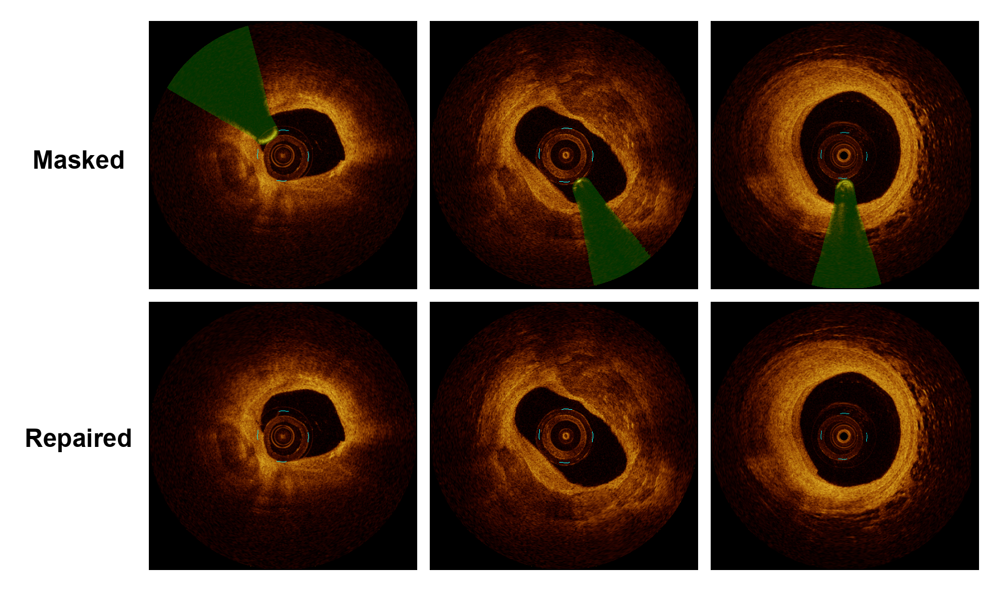

# WaveGuideDiff

Official PyTorch implementation of **WaveGuideDiff: A Wavelet-Guided Diffusion Model for Guidewire Artifact Removal in IVOCT Images**.

WaveGuideDiff is designed to repair guidewire artifacts in intravascular optical coherence tomography (IVOCT) images while preserving vessel structures and tissue details. The repository provides training, inference, and image-quality evaluation utilities for the full restoration pipeline.

## Highlights

- Wavelet-guided diffusion framework tailored to guidewire artifact removal in IVOCT images
- End-to-end workflow covering training, inference, and quantitative evaluation
- Config-driven inference pipeline for reproducible restoration experiments
- Integrated quality assessment based on `pyiqa`

## Visualization

<p align="center">
  
</p>

## Installation

### Environment

- Python 3.8 or later
- PyTorch 1.12 or later
- CUDA-capable GPU recommended for training and large-scale inference

### Dependencies

This repository does not currently include a top-level `requirements.txt`.

Core training dependencies are defined in `training/setup.py`, and the remaining utilities can be installed manually:

```bash
git clone https://github.com/Starfish0909/WaveGuideDiff.git
cd WaveGuideDiff

# Install the PyTorch build that matches your CUDA environment first.
pip install -e ./training
pip install pyiqa opencv-python pyyaml pillow
```

## Repository Structure

```text
WaveGuideDiff/
├── training/                    # Training code and launch script
├── inference/                   # Inference configs and test script
├── evaluation/                  # Image-quality evaluation scripts
├── datasets/example/            # Example images and visualization helpers
├── Visualization.png            # Overview figure shown in this README
└── README.md
```

## Data Preparation

Prepare paired training data before launching training. A typical layout is:

```text
data/
├── train_images/
│   ├── image1.png
│   ├── image2.png
│   └── ...
└── train_masks/
    ├── image1.png
    ├── image2.png
    └── ...
```

Before training, update the dataset-related paths in `training/train_waveguidediff.sh`.

## Training

Edit `training/train_waveguidediff.sh` and set the key variables, for example:

```bash
export DATA_DIR='/path/to/your/train_images'
export OPENAI_LOGDIR='/path/to/save/checkpoints'
```

Then launch training:

```bash
cd training
bash train_waveguidediff.sh
```

## Inference

Update `inference/confs/waveguidediff.yml` with your checkpoint path and evaluation data paths:

```yaml
model_path: '/path/to/checkpoint.pt'
data:
  eval:
    paper_face_mask:
      gt_path: '/path/to/test_images'
      mask_path: '/path/to/test_masks'
```

Run inference with:

```bash
cd inference
python test.py --conf_path confs/waveguidediff.yml
```

Or use the provided helper script:

```bash
cd inference
bash inference_waveguidediff.sh
```

## Evaluation

Evaluate repaired results against reference images with:

```bash
cd evaluation
python pyiqa_evaluation.py   --gt_dir /path/to/ground_truth   --pred_dir /path/to/predictions   --device cuda   --compute_fid
```

## Notes

- Install a PyTorch version compatible with your CUDA toolkit before installing the project package.
- Some evaluation backbones used by `pyiqa` may download or load pretrained weights on first use.
- The visualization figure in this repository is referenced directly by `README.md` for GitHub display.

## Citation

If this repository is useful for your research, please cite the corresponding paper. The citation entry can be updated here once the publication details are finalized.

## License

This project is released under the MIT License. See `LICENSE` for details.

## Acknowledgments

- [OpenAI Improved Diffusion](https://github.com/openai/improved-diffusion)
- [PyIQA](https://github.com/chaofengc/IQA-PyTorch)
