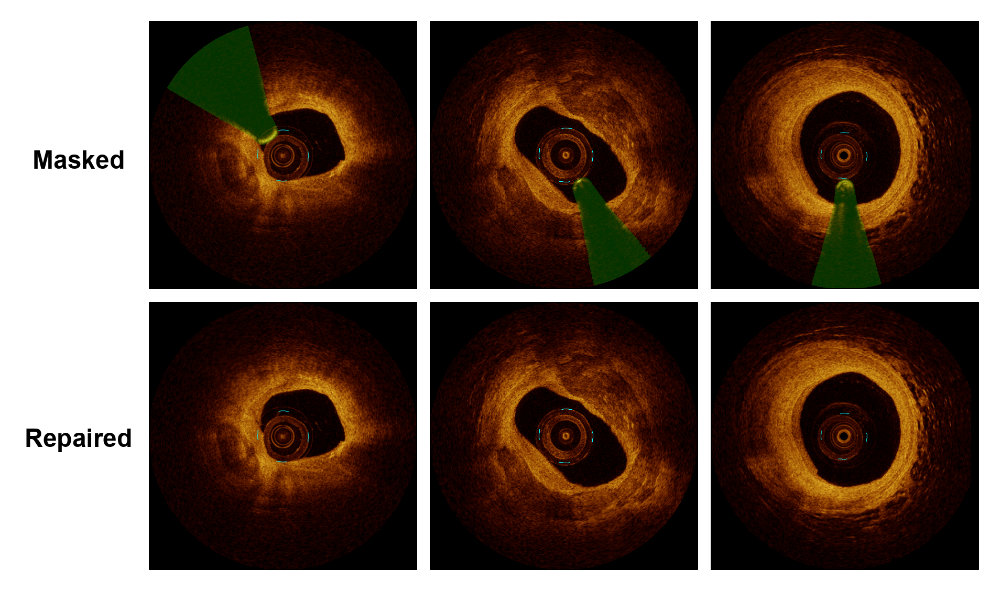

# WaveGuideDiff

## **WaveGuideDiff: A Wavelet-Guided Diffusion Model for Guidewire Artifact Removal in IVOCT Images**

WaveGuideDiff restores guidewire-occluded regions in intravascular optical coherence tomography (IVOCT) images while preserving surrounding vessel and tissue structures. This repository provides the model, training code, and inference pipeline.

## Visualization

<p align="center">
  
</p>

## Repository Structure

```text
WaveGuideDiff/
├── training/        # Model training code and scripts
├── inference/       # Inference code and configuration
├── shared/          # Shared model utilities
├── Visualization.png
└── README.md
```

## Environment

A Linux environment with a CUDA-capable GPU is recommended.

```bash
git clone https://github.com/Starfish0909/WaveGuideDiff.git
cd WaveGuideDiff
```

Install the PyTorch build that matches your CUDA environment, then install the remaining dependencies:

```bash
python -m pip install --upgrade pip
python -m pip install -e ./training
python -m pip install numpy pillow scipy einops timm torchvision matplotlib opencv-python pyyaml mpi4py
```

## Training

Edit `training/train_waveguidediff.sh` and configure:

- `OPENAI_LOGDIR`, `OUTPUT_DIR`, and `DATA_DIR`
- `NUM_IMAGES` and `TARGET_EPOCHS`
- `BATCH_SIZE` and `MICROBATCH`
- `CHECKPOINT_PATH` when resuming a run

Start training with:

```bash
cd training
bash train_waveguidediff.sh
```

## Inference

Set the checkpoint, input images, masks, and output directory in `inference/confs/waveguidediff.yml`:

```yaml
model_path: "/path/to/model.pt"

data:
  eval:
    paper_face_mask:
      gt_path: "/path/to/input_images"
      mask_path: "/path/to/keep_masks"
      paths:
        srs: "/path/to/restored_outputs"
        lrs: ""
        gts: ""
        gt_keep_masks: ""
```

Run inference with:

```bash
cd inference
python test.py --conf_path confs/waveguidediff.yml
```

Use the optional `--skip_existing` flag to skip images that have already been processed.

## Citation

If you use WaveGuideDiff in your research, please cite the corresponding paper. Publication details will be updated when available.

```bibtex
@article{waveguidediff,
  title   = {WaveGuideDiff: A Wavelet-Guided Diffusion Model for Guidewire Artifact Removal in IVOCT Images},
  author  = {To be updated},
  journal = {To be updated},
  year    = {To be updated}
}
```

## License

Except where otherwise noted, WaveGuideDiff is released under the
[CC BY-NC-SA 4.0 License](LICENSE) for non-commercial use. Third-party
components retain their original licenses; OpenAI-derived training code is
covered by the MIT notice in [`training/LICENSE`](training/LICENSE).

## Acknowledgments

This implementation builds on ideas and code from:

- [Improved Denoising Diffusion Probabilistic Models](https://github.com/openai/improved-diffusion)
- [Guided Diffusion](https://github.com/openai/guided-diffusion)
- [RePaint](https://github.com/andreas128/RePaint)
